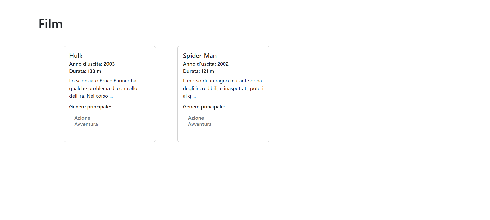

# PRIMO ESERCIZIO OOP

> Primo esercizio Programmazione Orientata agli Oggetti

## TECNOLOGIE e LIBRERIE:

- Html
- Css
- Bootstrap
- Php

## SVOLGIMENTO:

1. Creare un file index.php in cui è definita una classe 'Movie':

   - all'interno della classe sono dichiarate delle variabili d'istanza

   - all'interno della classe è definito un costruttore

   - all'interno della classe è definito almeno un metodo

2. Vengono istanziati almeno due oggetti 'Movie' e stampati a schermo i valori delle relative proprietà

## Bonus 1:

- Modificare la classe Movie in modo che accetti piú di un genere.

## Bonus 2:

- Creare un layout completo per stampare a schermo una lista di movies.
  - Suddividere il codice in appositi file e cartelle:
    <!-- - creando un file dedicato ai dati che potremmo chiamare db.php -->
    - Mettendo ciascuna classe nel proprio file e magari raggruppare tutte le classi in una cartella dedicata che possiamo chiamare Models
    - Organizzando il layout dividendo la struttura ed i contenuti in file e parziali dedicati.
